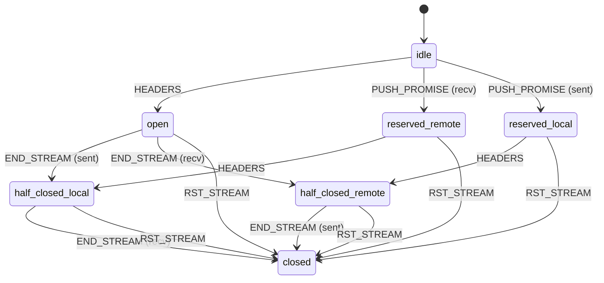

# HTTP/2 Client Library (MVP)

A minimal HTTP/2 client library written in C, designed to understand the internals of the protocol and experiment with custom behavior. This library handles connection preface, frame parsing, and basic stream management to allow simple HTTP/2 requests and responses over a single connection.

## Features

* HTTP/2 connection preface
* SETTINGS frame negotiation
* Frame reader/writer (supports DATA, HEADERS, SETTINGS, WINDOW\_UPDATE)
* Stream lifecycle state tracking
* HPACK-agnostic header encoding (stubbed for MVP)
* TLS support with ALPN for `h2`
* Arena allocator for efficient memory management

## Architecture Overview

```
        +---------------------------+
        |       http2_client       |
        +---------------------------+
        | tcp_connect + tls_init() |
        | send_preface()           |
        | frame_read/write         |
        | stream_dispatch()        |
        +---------------------------+
                      |
                +-----------+
                |    fd     |
                +-----------+
```

## Product-Oriented Work Breakdown Structure (WBS)

1. **Connection Management**

   * TLS handshake with ALPN
   * TCP socket lifecycle (open, monitor, close)

2. **Protocol Initialization**

   * Send HTTP/2 connection preface
   * Exchange SETTINGS frames

3. **Frame Processing Core**

   * Read and parse incoming frames
   * Build and send frames

4. **Stream Handling**

   * Track stream states
   * Route frames to correct stream context

5. **Memory Management**

   * Implement arena allocator
   * Manage per-connection and per-stream memory lifecycle

6. **MVP Request/Response Flow**

   * Send minimal HEADERS (GET /)
   * Handle HEADERS and DATA from server

7. **Testing and Debugging Utilities**

   * Basic frame logger
   * Example client interaction

## Dependencies

* OpenSSL (for TLS + ALPN)
* POSIX sockets
* C99 compliant compiler

## File Structure

```
/src
  http2.c/.h       - Core logic (frame parsing, stream mgmt)
  socket.c/.h      - TCP + TLS handling
  arena.c/.h       - Arena memory allocator
  main.c           - Example: GET / from nghttp2.org
/include
  http2.h
  arena.h
```

## Usage (Example)

```c
http2_conn_t conn;
http2_init(&conn, "nghttp2.org", 443);
http2_send_get(&conn, "/");
http2_read_response(&conn);
http2_close(&conn);
```

## Developer Notes and Observations

### `h2` vs `h2c` Protocol Modes

* `h2` refers to HTTP/2 over **TLS**. This is the standard in browsers and public HTTPS APIs.
* `h2c` refers to HTTP/2 over **cleartext TCP** (no encryption). It is useful in controlled environments like internal services or testing.
* The ALPN identifier `h2` is used during a TLS handshake to negotiate HTTP/2.
* For `h2`, all communication goes through `SSL_read()` / `SSL_write()`.
* For `h2c`, the client uses `read()` / `write()` directly on the socket.
* The HTTP/2 connection preface and frame format are the same for both `h2` and `h2c`.
* Most `h2c` implementations expect an initial HTTP/1.1 request with `Upgrade: h2c` headers, but some allow starting directly with the connection preface.

### Protocol Discovery and Negotiation

* Implementations that generate HTTP requests need to discover whether a server supports HTTP/2.
* HTTP/2 uses the `http` and `https` URI schemes.
* When using HTTPS, the client must advertise "h2" using ALPN (via `SSL_CTX_set_alpn_protos()`) to negotiate HTTP/2 during the TLS handshake.
* The ALPN identifier for "h2" is serialized as: `0x02 0x68 0x32` → where `0x68 = 'h'` and `0x32 = '2'`.

### Connection Preface

* The string "PRI \* HTTP/2.0

SM

" must be sent as the client connection preface.

* This preface is immediately followed by a `SETTINGS` frame (which can be empty).

### Frame Structure

* All frames begin with a fixed 9-octet header followed by a variable-length payload.
* Frame layout:

```c
// HTTP/2 Frame structure
struct http2_frame_header {
  uint32_t length : 24;
  uint8_t type;
  uint8_t flags;
  uint32_t reserved : 1;
  uint32_t stream_id : 31;
};
```

### HTTP/2 Stream lifecycle



### Settings Constraints

* The `SETTINGS_MAX_FRAME_SIZE` setting controls the maximum size of a frame’s payload.

  * Valid range: 16,384 (2^14) to 16,777,215 (2^24 - 1) bytes.

* Implementations that generate HTTP requests need to discover whether a server supports HTTP/2.

* HTTP/2 uses the `http` and `https` URI schemes.

* When using HTTPS, the client must advertise "h2" using ALPN (via `SSL_CTX_set_alpn_protos()`) to negotiate HTTP/2 during the TLS handshake.

* The ALPN identifier for "h2" is serialized as: `0x02 0x68 0x32` → where `0x68 = 'h'` and `0x32 = '2'`.

* The string "PRI \* HTTP/2.0\r\n\r\nSM\r\n\r\n" must be sent as the client connection preface.

* This preface is immediately followed by a `SETTINGS` frame (which can be empty).

* All frames begin with a fixed 9-octet header followed by a variable-length payload.

* Frame layout:

```c
// HTTP/2 Frame structure
struct http2_frame_header {
  uint32_t length : 24;
  uint8_t type;
  uint8_t flags;
  uint32_t reserved : 1;
  uint32_t stream_id : 31;
};
```

* The `SETTINGS_MAX_FRAME_SIZE` setting controls the maximum size of a frame’s payload.

  * Valid range: 16,384 (2^14) to 16,777,215 (2^24 - 1) bytes.

## Useful References

* RFC 9113: [https://datatracker.ietf.org/doc/html/rfc9113](https://datatracker.ietf.org/doc/html/rfc9113)
* Wikipedia: [https://en.wikipedia.org/wiki/HTTP/2](https://en.wikipedia.org/wiki/HTTP/2)
* Redis Event Loop Implementation Guide: [https://build-your-own.org/redis/06\_event\_loop\_impl](https://build-your-own.org/redis/06_event_loop_impl)
* Arena Allocator Tutorial: [https://nullprogram.com/blog/2023/09/27/](https://nullprogram.com/blog/2023/09/27/)

## TODO (Post-MVP)

* Full HPACK header compression support
* Stream prioritization
* PUSH\_PROMISE support
* Frame logging in pcap-like format
* Flow control tuning
* Multiplexing multiple concurrent streams

## License

GPL-3.0 license

---

**Author**: Lorris Belus - Developer

```
()=()
(^;^)
C × C
()_()
```

